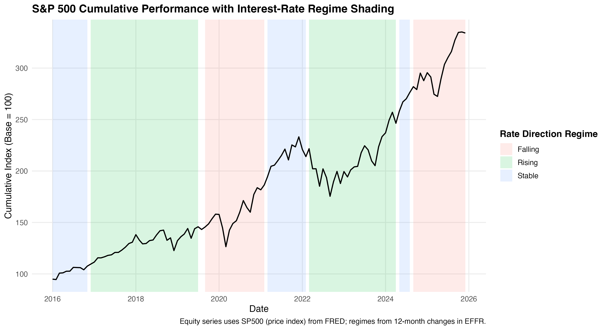
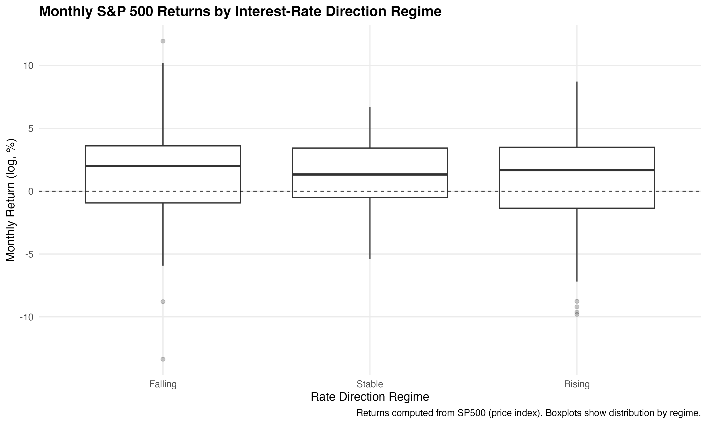
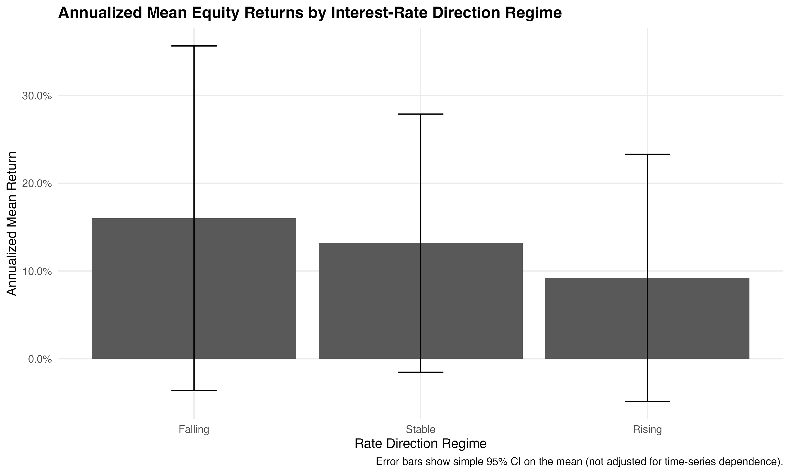

# macro-regimes-asset-returns


## At-a-Glance (Results)
- **Question:** Do U.S. equity returns differ across interest-rate direction regimes defined from FRED data?
- **Data:** FRED (EFFR, CPIAUCSL, SP500, DGS10, TB3MS) • **~1990–2024** • **monthly**
- **Regimes:** Rate direction from **12-month change in EFFR** (Rising / Falling / Stable)
- **Key result (SP500 monthly log returns):**
  - **Falling-rate:** mean **1.315%** / month (annualized **15.78%**), vol **4.94%** (annualized **17.12%**), **n = 33**
  - **Rising-rate:** mean **0.767%** / month (annualized **9.21%**), vol **4.56%** (annualized **15.80%**), **n = 58**
  - **Stable-rate:** mean **1.331%** / month (annualized **15.97%**), vol **3.13%** (annualized **10.84%**), **n = 27**
- **Stat test (Rising vs Falling):** mean difference **-0.576%** / month; **p = 0.570**; 95% CI **[-1.435%, 2.587%]** (see `output/tables/t_test_equity_rising_vs_falling.csv`; interpret cautiously due to serial dependence)
- **Proof artifacts:** Figures in `output/figures/` and summary tables in `output/tables/`


## Quickstart
1. Clone the repository
2. Open in RStudio
### Run end-to-end (from project root in RStudio)
```r
source("scripts/InterestRegime01.R")
source("scripts/InterestRegime02.R")
source("scripts/InterestRegime03.R")
source("scripts/InterestRegime04.R")
```
### Validate outputs(run in terminal from project root)
```bash
ls -lah output/tables
ls -lah output/figures
```

## Overview
This project presents an empirical macro-finance analysis examining how U.S. interest-rate and inflation regimes relate to equity and fixed-income asset behavior. Rather than relying on narrative or political classifications, macroeconomic regimes are defined quantitatively using historical Federal Reserve data.

The primary objective is to evaluate whether equity performance differs meaningfully across rising, falling, and stable interest-rate environments, and to assess the extent to which these differences are economically and statistically meaningful.

---

## Data
Macroeconomic and financial time series were retrieved programmatically from the Federal Reserve Economic Data (FRED) database using reproducible R workflows.

**Key series include:**
- Effective Federal Funds Rate (EFFR)
- Consumer Price Index (CPIAUCSL)
- S&P 500 price index (SP500)
- 10-Year Treasury yield (DGS10)
- 3-Month Treasury Bill rate (TB3MS)

**Data coverage:** approximately 1990–2024  
**Frequency:** monthly (aggregated from daily where applicable)

---

## Methodology
- Daily and monthly series were aligned to a common monthly frequency  
- Inflation was computed as year-over-year CPI growth  
- Interest-rate direction regimes were classified using 12-month changes in the federal funds rate  
- Rate-level and inflation regimes were defined using historical percentiles  
- Monthly equity returns were computed using log returns of the S&P 500 price index  
- Regime-based comparisons were conducted using summary statistics and two-sample tests  

The analysis emphasizes economic magnitude and interpretability, recognizing the inherent noise and serial dependence present in macroeconomic financial time series.

---

## Key Findings
- Equity returns were higher during **Stable and Falling** rate regimes than during **Rising** rate regimes  
- Differences in average returns were economically meaningful but statistically noisy (t-test not significant; see `output/tables/t_test_equity_rising_vs_falling.csv`)  
- Results are consistent with macro-finance intuition around discount rates and monetary policy transmission  


---

## Visual Summary

### Regimes and equity performance over time



### Distribution of monthly equity returns by regime



### Annualized mean returns by regime


---

## Repository Structure
```
macro-regimes-asset-returns/
├── data/
│   ├── raw/
│   └── processed/
├── scripts/
│   ├── InterestRegime01.R
│   ├── InterestRegime02.R
│   ├── InterestRegime03.R
│   └── InterestRegime04.R
├── output/
│   ├── tables/
│   └── figures/
├── report/
│   └── macro_regimes_analysis.Rmd
├── README.md
└── LICENSE
```

---

## Reproducibility
All results in this repository are reproducible. Scripts should be run sequentially (`01` → `04`) from the project root. No manual data downloads are required.

---

## Notes
- The S&P 500 series used is a **price index** and does not include dividends.  
- Bond behavior is proxied using changes in Treasury yields rather than total return indices.  
- This project was conducted as an independent research study for portfolio and skill development purposes.  

---

## Tools
R, quantmod, tidyverse, ggplot2, time-series analysis
